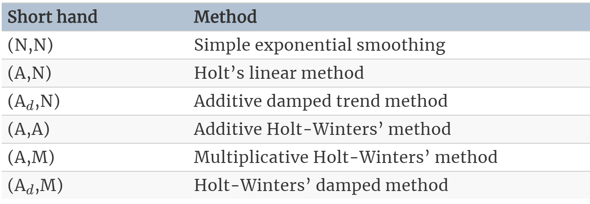
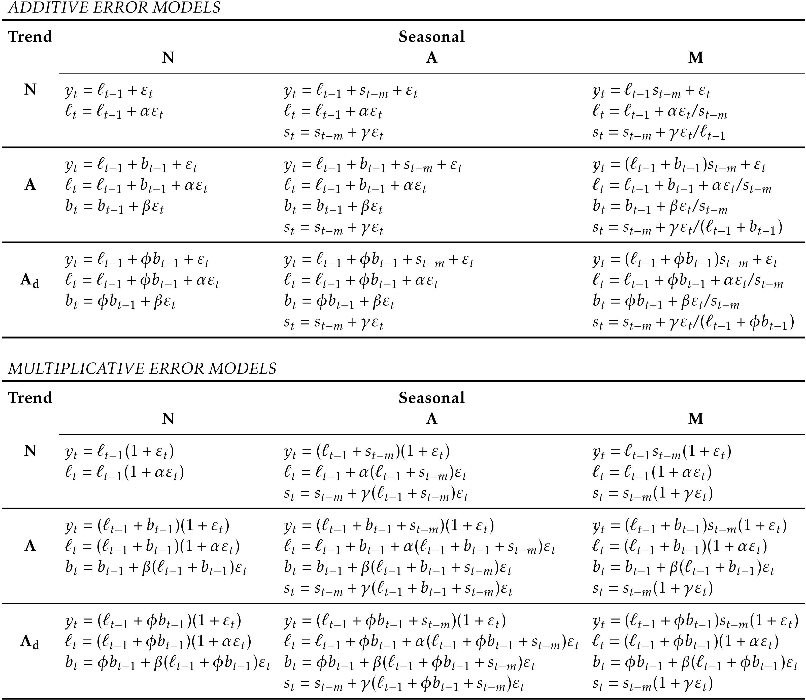

```{r, message=FALSE, echo=FALSE}
rm(list=ls())
graphics.off()
```

```{r, message=FALSE}
# libraries
library("fpp2")
```

#### Example: Holt-Winter (additive / multiplicative)

```{r}
# data
aust <- window(austourists,start=2005)

# holt-winter
fit1 <- hw(aust,seasonal="additive")
fit1[["model"]]
fit2 <- hw(aust,seasonal="multiplicative")
fit2[["model"]]

# plot
autoplot(aust) +
  autolayer(fit1, series="HW additive forecasts", PI=FALSE) +
  autolayer(fit2, series="HW multiplicative forecasts",
    PI=FALSE) +
  xlab("Year") +
  ylab("Visitor nights (millions)") +
  ggtitle("International visitors nights in Australia") +
  guides(colour=guide_legend(title="Forecast"))


```

- Smoothing parameters and initial estimates for components have been estimated by minimising RMSE

#### Holt-Winters' damped method

Damped trend is possible with additive and multiplicative seasonality. Often accurate and robsut forecasts for seasonal data with a damped trend and multiplicative seasonality, i.e. using `hw(y, damped=TRUE, seasonal="multiplicative")`:

$$
\begin{align*}
  \hat{y}_{t+h|t} &= \left[\ell_{t} + (\phi+\phi^2 + \dots + \phi^{h})b_{t}\right]s_{t+h-m(k+1)}. \\
  \ell_{t} &= \alpha(y_{t} / s_{t-m}) + (1 - \alpha)(\ell_{t-1} + \phi b_{t-1})\\
  b_{t} &= \beta^*(\ell_{t} - \ell_{t-1}) + (1 - \beta^*)\phi b_{t-1}             \\
  s_{t} &= \gamma \frac{y_{t}}{(\ell_{t-1} + \phi b_{t-1})} + (1 - \gamma)s_{t-m}.
\end{align*}
$$

```{r}
### Example: HW daily data
# model
fc <- hw(subset(hyndsight,end=length(hyndsight)-35),
         damped = TRUE, seasonal="multiplicative", h=35)

# plot
autoplot(hyndsight) +
  autolayer(fc, series="HW multi damped", PI=FALSE)+
  guides(colour=guide_legend(title="Daily forecasts"))
```

## Taxonomy of exponential smoothing

Variations in the components of the trend and seasonal components yield nine exponential smoothing methods. 


Some of these have already been introduced before:

{width=66%}

Multiplicative trend methods are not considered here as they tend to produce bad forecasts. 

Overview of all the equations related to the nine exponential smoothing methods: 


- $l_t$ denotes series level
- $b_t$ denotes slope at time t
- $s_t$ denotes the seasonal component of the series
- $m$ denotes number of seasons in a year
- $\alpha, \beta^\star, \gamma, \phi$ are smoothing parameter
- $\phi_h = \phi + \phi^2 + ... + \phi^h$
- $k$ is the integer part of $(h-1)/m$

## Innvations state space models for exponential smoothing

So far, algorithms which generate point forecasts. Now, we'll use a statistical model which also generates prediction intervals. 

- **Statistical Model:** Stochastic, data-generating process

Each model consists of: 

- Measurement equation: describing observed data
- State equations: describe unobserved components or states (level, trend, seasonal) changing over time

Both equations together are referred to as **state space models**. Each method has two models: one with additive errors and one with multiplicative errors. Point forecasts produced are identical if they have the same smoothing parameter values. 

To distinguish between model with additive/multiplicative errors, a third letter is added leading to the model called ETS(.,.,.) for (Error, Trend, Seasonal). 

Possibilities for each component: 

- $Error = {A, M}$
- $Trend = {N, A, A_d}$
- $Seasonal = {N, A, M}$

#### ETS(A,N,N): Simple exponential smoothing, additive errors 

Recall the component form: 

$$
\begin{align*}
  \text{Forecast equation}  && \hat{y}_{t+1|t} & = \ell_{t}\\
  \text{Smoothing equation} && \ell_{t}        & = \alpha y_{t} + (1 - \alpha)\ell_{t-1},
\end{align*}
$$

Re-arrange smoothing equation for the level

$$
\begin{align*}
\ell_{t} &= \alpha y_{t}+\ell_{t-1}-\alpha\ell_{t-1}\\
         &= \ell_{t-1}+\alpha( y_{t}-\ell_{t-1})\\
         &= \ell_{t-1}+\alpha e_{t}
\end{align*}
$$

where 

$$
e_t = y_t - l_{t-1} = y_t - \hat{y}_{t|t-1}
$$

We can also rewrite this as 

$$ 
y_t = l_{t-1} + e_t 
$$
- Each observation is represented by last period's level plus error
- Specify probability distribution for $e_t$ to make it an innovations state space model
- Additive errors: Assume residuals (one-step training errors) $e_t$ are normally distirbuted. 

$$
\begin{align}
  y_t &= \ell_{t-1} + \varepsilon_t \\
  \ell_t&=\ell_{t-1}+\alpha \varepsilon_t. 
\end{align}
$$

Where the first is the measurement (or observation) equation and the second the state equation. Togehter with the assumption of the error distribution we have a fully specified statistical model. 

- Measurement equation shows relationship between observations and unobserved states. 
- Here: $y_t$ is a linear function of the predictable part (the level $l_t$) and the unpredictable part (error $\varepsilon_t$)
- State equation shows the evolution of the state


#### ETS(M, N, N): Simple exponential smoothing with multiplicative errors

Specify models with multiplicative errors by writing the one-step-ahead training errors as relative errors:

$$
\varepsilon_t = \frac{y_t-\hat{y}_{t|t-1}}{\hat{y}_{t|t-1}}
$$
This can be formulated as state space model in the following way: 

$$
\begin{align*}
  y_t&=\ell_{t-1}(1+\varepsilon_t)\\
  \ell_t&=\ell_{t-1}(1+\alpha \varepsilon_t).
\end{align*}
$$

#### ETS(A,A,N): Holt's linear method with additive errors

- additive errors
- trend
- no seasonlity

One-step-ahead training errors are given by $\varepsilon_t = y_t - l_{t-1} - b_{t-1} \sim NID(0,\sigma^2)$.

Holt's linea method is then formulated as:

$$
\begin{align*}
y_t&=\ell_{t-1}+b_{t-1}+\varepsilon_t\\
\ell_t&=\ell_{t-1}+b_{t-1}+\alpha \varepsilon_t\\
b_t&=b_{t-1}+\beta \varepsilon_t,
\end{align*}
$$
where, for simplicity, we have $\beta = \alpha \beta^\star$

#### ETS(M,A,N): Holt's linear methods with multiplicative errors

One-step-ahead training errors as relative errors:

$$
\varepsilon_t=\frac{y_t-(\ell_{t-1}+b_{t-1})}{(\ell_{t-1}+b_{t-1})}
$$

Innovations state space model: 

$$
\begin{align*}
y_t&=(\ell_{t-1}+b_{t-1})(1+\varepsilon_t)\\
\ell_t&=(\ell_{t-1}+b_{t-1})(1+\alpha \varepsilon_t)\\
b_t&=b_{t-1}+\beta(\ell_{t-1}+b_{t-1}) \varepsilon_t
\end{align*}
$$

where again $\beta = \alpha \beta$ and $\varepsilon \sim NID(0,\sigma^2)$

### Other ETS models

All statee equations for each of the models in the ETS framework. 



## Estimation and model selection

#### Estimating ETS models

Two appraoches: 

- Minimising sum of squared errors
- Alternative: Maximise "likelihood"

Same results for additive error model but different results for multiplicative error models. Estimate smoothing parameters 

- $\alpha, \beta, \gamma, \phi$

and initial states

- $\ell_0, b_0, s_0, s_{-1}, ..., s_{-m+1}$ 

by MLE.

- Possible values are restricted

## Model selection

In the ETS framework information criteria can be used for model selection. For ETS models these are defined as 

$$
\text{AIC} = -2\log(L) + 2k
$$
- L is likelihood of the model and $k$ the total number of parameters and initial states 

$$
\text{AIC}_{\text{c}} = \text{AIC} + \frac{k(k+1)}{T-k-1},
$$
$$
\text{BIC} = \text{AIC} + k[\log(T)-2].
$$

Following models can cause numerical difficulties due to division by values potentially close to zero in the state equations: 

- ETS(A,N,M)
- ETS(A,A,M)
- ETS(A,A$_d$,M)

In general, we do not consider these particular combinations when selecting a model.

Models with multiplicative errors are useful when data are strictly positive, but not numerically stable when the data contain zeros or negative values. 

Therefore, multiplicative error models will not be considered if the time series is not strictly positive. Only the six fully additive models will be applied.

#### The `ets()` function in R

Unlike previous methods (i.e. `ses()`, `holt()`, `hw()`), the `ets()` function yields a model with estimated parameters and information about the fitted model. AICc is used to select an appropriate model, although other information criteria can be selected. 

- For more information use `?ets()`

#### Working with `ets()` objects

The function returns an object of class `ets`. Important functions: 

- `coef()`: returns fitted parameters
- `accuracy()`: returns accuracy measures computed on training data
- `summary()` prints summary information
- `autoplot()`,`plot()`: time plots of the components
- `residuals()`: returns residuals from the estimated model 
- `fitted()`: returns one-step forecasts for the training data. 
- `simulate()`: will simulate future sample paths from the fitted model.
- `forecast()`: computes point forecasts and prediction intervals 

#### Example: International tourist visitor nights in Australia

```{r}
aust <- window(austourists, start = 2005)
fit <- ets(aust)

# see model fit
summary(fit)

# plot
autoplot(fit)
```

The model selected is ETS(M,A,M):

$$
\begin{align*}
y_{t} &= (\ell_{t-1} + b_{t-1})s_{t-m}(1 + \varepsilon_t)\\
\ell_t &= (\ell_{t-1} + b_{t-1})(1 + \alpha \varepsilon_t)\\
b_t &=b_{t-1} + \beta(\ell_{t-1} + b_{t-1})\varepsilon_t\\
s_t &=  s_{t-m}(1+ \gamma \varepsilon_t).
\end{align*}
$$


