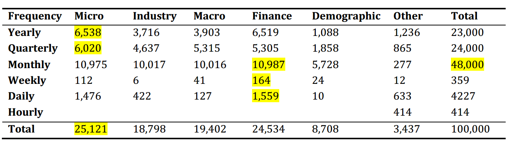
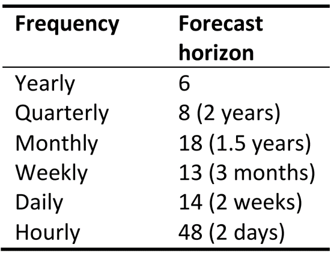

```{r, message=FALSE, echo=FALSE}
rm(list=ls())
graphics.off()
```

# M4 Competition Toolkit
The following document is a collection of functions to work with the M4 Competition data. In particular the package `M4comp2018` comprising all 100,000 time series will be used. 

In a first step we will go over basic functionalities, i.e. how to extract monthly train and test data. Next, the accuracy measures of the competition will be introduced and some other useful functions (like a seasonality test) will be shown. Afterwards, some benchmarks will be calculated and accuracy measured on individual time series. 

Following docs will show how this could be applied to the entire dataset and some of the methods will be introduced, applied to an example before being applied to the M4Comp data. 

## 1. Working with the data
A first step is to load the required packages. If the library `M4comp2018` is not installed yed, please unquote and load from the github source. The standard libraries can be insatlled, if necessary, as usual. 

```{r, message=FALSE}
# standard libraries
library(forecast)
library(ggplot2)

# Unquote next line if not installed 
# devtools::install_github("carlanetto/M4comp2018")
library(M4comp2018)
```

In a first step we'll load the data into the R environment. Note that this data set is really big. 
```{r}
# load data
data(M4)
names(M4[[1]])
```

#### Data description

The dataset M4 consists of a list of 100,000 time series from different domains and different frequencies: 

```{r, echo=FALSE, out.width="80%"}

```

Each series within M4 has the following structure: 

- `st`: Series number and period. "Y1" denotes first yearly series, "Q20" denotes 20th quarterly series
- `n`: Number of observations
- `h`: Number of required forecasts or required forecast horizon. Note that this is also the length of the given test set. 
- `period`: The interval of the time series. Possible values are "Yearly", "Quarterly", "Monthly", "Weekly", "Daily", and "Hourly". Note that this will be used interchangeably with the term "frequency" which may have different meaning in other disciplines. 
- `type`: Domain type of the series. Possible values are "Demographic", "Finance", "Industry", "Macro", "Micro", and "Other".
- `x`: Time series of length n consisting of the historical data.
- `xx`: Time series of length n consisting of the future data, i.e. the data that had to be forecasted in the competition. Note that these data were not given at the time of the competition

The fact that future data `xx` were not given during competition added another layer of complexity. Each approach had to come up with a way of validating their method, i.e. using different splits for train and test data, window functions, cross-validation methods, etc.  

For now, we'll use the historical data `x` as train data and the future data `xx` as test data but this should be kept in mind.

Moreover, series start is provided in the following ways: 

- Yearly, Monthly and Quarterly: Year format is given. 
- Daily and Hourly: Given in the number of days after 1970-01-01. 
- Weekly: Given in the number of weeks since 1970-01-01.

For more information visit this link to the [M4 competition data](https://www.mcompetitions.unic.ac.cy/the-dataset/).

#### How to extract data for a specific frequency?
It is useful to approach the split the data by frequency as different frequencies may require different approaches. Note that the competition did not specify that a one-method-fits all is required to be used. There were different approaches who used frequency-specific methods. In theory one could have also estimated each of the 100,000 series individually, e.g. by visual inspection and then using a method that seems reasonable to produce forecasts. 

Extract a subset of all yearly data:

```{r}
# extract yearly series
yearly_M4 <- Filter(function(l) l$period =="Yearly", M4)
length(yearly_M4)

# number for one of the yearly ts
nr <- 2312
train1 <- yearly_M4[[nr]]$x
test1 <- yearly_M4[[nr]]$xx

length(train1)

```

In addition, one individual series has been selected, i.e. the 18th yearly series (no specific reason for 18). There are `r length(yearly_M4)` yearly time series. See the following table for a more complete overview. 

We can plot the extracted series in the following way: 

```{r}
autoplot(train1) +
  autolayer(test1, series="test1")
``` 

Similarly, we can extract monthly series by specifying "Monthly" instead of "Yearly". Data can be selected by period using: 

- "Yearly", "Quarterly", "Monthly", Weekly", "Daily", and "Hourly"

```{r}
# extract monthly series 
monthly_M4 <- Filter(function(l) l$period=="Monthly", M4)
length(monthly_M4)

nr <- 123
train2 <- monthly_M4[[nr]]$x
test2 <- monthly_M4[[nr]]$xx 

autoplot(train2) +
  autolayer(test2, series = "test2")
```  

#### Extract (domain) type-specific data

In a related way we can filter the data by domain. Possible domains are: 

- "Demographic", "Finance", "Industry", "Macro", "Micro", "Other". 

```{r}
# 
macro_M4 <- Filter(function(l) l$type=="Macro", M4)
length(macro_M4)

# select series
nr <- 14110
train3 <- macro_M4[[nr]]$x
test3 <- macro_M4[[nr]]$xx

macro_M4[[nr]]$period

# plot 
autoplot(train3) +
  autolayer(test3, series="test3")
```

From here, we'll use one individual series for illustration purposes: 

```{r}
# check ts 40773
train <- M4[[40773]]$x
test <- M4[[40773]]$xx

# plot
autoplot(train) +
  autolayer(test, series="test")
```

In order to free up memory, we'll clear the environment from the data except the training and testing sets. On my machine this cleared up roughly 1GB of working memory.

```{r}
# clear-memory-except
rm(list=setdiff(ls(), ls()[grep(pattern=c("test|train"), x=ls())] ) )
```

Next, we'll go over some functions that will be used in later stages of this project, i.e. functions to calculate the competitions's accuracy measures, forecast horizons, seasonality test, etc. 

## Forecast horizon

The objective of the competition was to predict point estimates and 95% prediction intervals (PI). Forecasting horizons were specified based on the frequency: 

```{r, echo=FALSE, out.width="35%"}

```

The forecast horizon can be determined using the  `give_fh` function: 

```{r}
# give_fh
give_fh <- function(input){
  if(frequency(input)==1){
    fh <- 6
  } else if(frequency(input)==4){
    fh <- 8
  } else if(frequency(input)==12){
    fh <- 18
  } else if(frequency(input)==52){
    fh <- 13
  } else if(frequency(input)==365){
    fh <- 14
  } else if(frequency(input)==8760){
    fh <- 48
  }
  return(fh)
}

# Example 
give_fh(test)
```

## Forecast accuracy measures
Ranks in the competition were determined by overall weighted average (OWA) of two accuracy measures:

- Symmetric mean absolute percentage error (sMAPE)
- Mean absolute scaled error (MASE)

#### Scale-dependent errors 
As the data of the competition have different units, scale-dependent measures can not be used to make comparisons between them. Hence, the competition uses the percentage error measure of sMAPE and the scaled error measure MASE.

#### Symmetric mean absolute percentage error (sMAPE)

- Belongs to the class of **percentage errors**
- based on the  percentage error: $p_t = 100 \times (e_t / y_t)$
- sMAPE is a modified version of mean absolute percentage error (MAPE): $MAPE = mean(|p_t|)$
- advantage of being unit-free
- disadvantage of being infinite or undefined if $y_t = 0$ for any t in the period of interest, and having extreme values if any $y_t$ is close to zero.

Hyndman and Koehler (2006) recommend that the sMAPE not be used (TM: But why they use it in 2018?). 

$$
\begin{align*}
sMAPE = \frac{1}{h} \sum_{t=1}^h \frac{2 \,|Y_t-\hat{Y}_t |}{|Y_t| + |\hat{Y}_t|}
\end{align*}
$$

- $Y_t$: Post sample value (also denoted as  `outsample` later on)
- $\hat{Y}_t$: Estimated forecast
- $h$: forecasting horizon
- $m$: frequency of the data

```{r}
# sMAPE calculation function
cal_sMAPE <- function(outsample, forecasts){ 
  outsample <- as.numeric(outsample)
  forecasts <- as.numeric(forecasts)
  num <- abs(outsample-forecasts)*2
  denom <- abs(outsample) + abs(forecasts)
  
  smape <- mean(num/denom, na.rm=TRUE)
  return(smape)
}
```

#### Mean absolute scaled error (MASE)

As an alternative to percentage errors Hyndman and Koehler (2006) propose **scaled errors** such as the MASE when comparing forecast accuracy across series with different units. 

- Scaling using the Mean absolute error (MAE) from a simple forecast method
- Simple forecast method usually naive method or seasonal naive method. 
- Based on naive / seasonal naive a forecast error $e_j$ is constructed.
- $e_j$ is scaled (see denominator).

$$
\begin{align*}
MASE = \frac{1}{h} \, \frac{ \sum_{t=1}^h |Y_t - \hat{Y}_t| }{ \frac{1}{n-m} \sum_{t=m+1}^n |Y_t - Y_{t-m}|}
\end{align*}
$$
In case of non-seasonal data $m=1$. Thus, $Y_t - Y_{t-m} = Y_t - Y_{t-1}$ being the naive forecast error, yielding the non-seasonal version of MASE:

$$
\begin{align*}
MASE = \frac{1}{h} \, \frac{ \sum_{t=1}^h |Y_t - \hat{Y}_t| }{ \frac{1}{n-1} \sum_{t=m+1}^n |Y_t - Y_{t-1}|}
\end{align*}
$$

```{r}
# Calculate MASE

cal_MASE <- function(insample, outsample, forecasts){
  frq <- frequency(insample)
  forecastsNaiveSD <- rep(NA, frq)

  for (j in (frq+1): length(insample)){
    forecastsNaiveSD <- c(forecastsNaiveSD, insample[j-frq])
  }

  masep <- mean(abs(insample - forecastsNaiveSD),na.rm=TRUE)
  outsample <- as.numeric(outsample)
  forecasts <- as.numeric(forecasts)

  mase <- mean((abs(outsample - forecasts)) / masep)

  return(mase)
}

```

#### Seasonality Test

The following seasonality test is used to determine whether a time series is seasonal. Based on the results of this test either a naive or seasonal naive method is used for the MASE. 

```{r}
SeasonalityTest <- function(input, ppy){
  #Used to determine whether a time series is seasonal
  tcrit <- 1.645
  if (length(input)<3*ppy){
    test_seasonal <- FALSE
  }else{
    xacf <- acf(input, plot = FALSE)$acf[-1, 1, 1]
    clim <- tcrit/sqrt(length(input)) * sqrt(cumsum(c(1, 2 * xacf^2)))
    test_seasonal <- ( abs(xacf[ppy]) > clim[ppy] )
    
    if (is.na(test_seasonal)==TRUE){ test_seasonal <- FALSE }
  }
  
  return(test_seasonal)
}
```

## Application

In the following we'll apply some benchmark methods and the respective measures on one monthly series. In a later step, we'll progress in the following way, collecting measures of accuracy: 

- Apply framework and benchmarks on a sample of "Monthly" ("Yearly", "Quarterly") series 
- Apply framework to all "Monthly" time series 
- Apply to all data in the M4Comp2018 dataset

So far, we have collected 4 time series with train and test data: 

- `train`, `test`: Monthly, $n=178$
- `train1`, `test1`: Yearly, $n=41$  
- `train2`, `test2`: Monthly, $n=822$
- `train3`, `test3`: Quarterly, $n=126$

#### Application to individual time series

```{r}
# Example: train, test
fh <- give_fh(train)
fh 

# naive forecast
f1 <- naive(train, h=fh)$mean

# seasonal naive 
f2 <- snaive(train, h=fh)$mean

# plot series and s/naive forecasts
autoplot(train) +
  autolayer(test, series="test") +
  autolayer(f1, series="Naive") +
  autolayer(f2, series="Seasonal Naive") +
  ggtitle("Forecasts from naive methods") +
  guides(colour=guide_legend(title="Forecast"))

# Seasonality?
SeasonalityTest(train, frequency(train))

# sMAPE
cal_sMAPE(outsample = test, forecasts = f1)
cal_sMAPE(outsample = test, forecasts = f2)

# MASE
cal_MASE(insample = train, outsample = test, forecasts = f1)
cal_MASE(insample = train, outsample = test, forecasts = f2)
```

#### Overall weighted average

The main measure evaluated is the overall weighted average (OWA) of the aforementioned two accuracy measures (sMAPE, MASE). To get the OWA: 

- Divide errors (sMAPE, MASE) by the error of the naive forecast based on deseasonalized data (naive2). This yields **relative MASE** and **relative sMAPE**
- Different to seasonal naive forecast!
- Compute OWA by averaging the relative MASE and relative sMAPE

Accordingly, we first need to decompose the series which we'll do in the next section before returning in order to calculate the OWA. 

## Time Series Decomposition

Some of the benchmark methods as well as the naive2 method for the calculation of the relative versions of MASE and sMAPE require a decomposition of the time series. The forecast methods are then applied on the deseasonalized series. 

When time series are decomposed into components, usually the individual components are: 

- **trend-cycle** component (sometimes called **trend** for simplicity)
- **seasonal component**
- **remainder component** (everything else)

Assuming an **additive decomposition** we can formulate this as 

$$
y_{t} = S_{t} + T_{t} + R_t,
$$

and assuming a **multiplicative decomposition** formalized by  

$$
y_{t} = S_{t} + T_{t} + R_t,
$$

In both cases: 

- $S_t$ is the seasonal component,
- $T_t$ the trend-cycle component,
- $R_t$ the remainder component 

Seasonally adjusted series contain the remaineder component as well as the trend-cycle.

#### Classical decomposition

To decompose a time series into seasonal, trend and irregular components the M4 competition benchmarks use the so-called **classical decomposition** based on moving averages. In R, the decomposition can be calculated using the `decompose()` function.

There are two forms of the classical decomposition: 

- additive decomposition 
- multiplicative decomposition

In the additive version of the classical decomposition the seasonal component is assumed to be constant, whereas for multiplicative seasonality the seasonality is varying. In the M4 competition the "multiplicative" version is used, which will therefore be introduced and demonstrated here. The additive decomposition, however, works similar. 

#### Multiplicative decomposition

Description follows Hyndman and Athanosopoulos (2018):

- **Step 1:** If $m$ is an even number, compute the trend-cycle component $\hat{T}_t$ using a 
$2\times m$ - MA. If $m$ is an odd number, compute the trend-cycle component $\hat{T}_t$ using an $m$-MA. 
- **Step 2:** Calculate the detrended series: $y_t / \hat{T}_t$. 
- **Step 3:** Average the detrended values for each season to estimate the seasonal component. For quarterly data, the seasonal index of the first quarter is the average of all detrended values for this quarter. Afterwards, we have to adjust these indices so they add to $m$. Seasonal component can then be obtained by replicating the sequence yielding $\hat{S}_t$.
- **Step 4:** The remainder component is calculated by dividing out the estimated seasonal and trend-cycle components: $\hat{R}_t = y_t / (\hat{T}_t \hat{S}_t)$

```{r}
# classical decomposition of train
dec <- decompose(train, type="multiplicative")

# plot
autoplot(dec) +
  xlab("Year")
```


