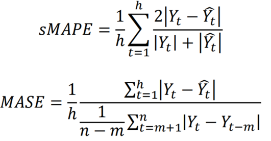

```{r, message=FALSE, echo=FALSE}
rm(list=ls())
graphics.off()
```

# M4 Competition Toolkit
The following document is a collection of functions to work with the M4 Competition data. In particular the package `M4comp2018` comprising all 100,000 time series will be used. 

In a first step we will go over basic functionalities, i.e. how to extract monthly train and test data. Next, the accuracy measures of the competition will be introduced and some other useful functions (like a seasonality test) will be shown. Afterwards, some benchmarks will be calculated and accuracy measured on individual time series. 

Following docs will show how this could be applied to the entire dataset and some of the methods will be introduced, applied to an example before being applied to the M4Comp data. 

## 1. Working with the data
A first step is to load the required packages. If the library `M4comp2018` is not installed yed, please unquote and load from the github source. The standard libraries can be insatlled, if necessary, as usual. 

```{r, message=FALSE}
# standard libraries
library(forecast)
library(ggplot2)

# Unquote next line if not installed 
# devtools::install_github("carlanetto/M4comp2018")
library(M4comp2018)
```

In a first step we'll load the data into the R environment. Note that this data set is really big. 
```{r}
# load data
data(M4)
names(M4[[1]])
```

#### Data description
The dataset M4 consists of a list of 100,000 time series from different domains and different frequencies: 

```{r, fig.cap="" , out.width="70%"}
knitr::include_graphics("images/series_overview.png")
```

Each series within M4 has the following structure: 

- `st`: Series number and period. "Y1" denotes first yearly series, "Q20" denotes 20th quarterly series
- `n`: Number of observations
- `h`: Number of required forecasts or required forecast horizon. Note that this is also the length of the given test set. 
- `period`: The interval of the time series. Possible values are "Yearly", "Quarterly", "Monthly", "Weekly", "Daily", and "Hourly". Note that this will be used interchangeably with the term "frequency" which may have different meaning in other disciplines. 
- `type`: Domain type of the series. Possible values are "Demographic", "Finance", "Industry", "Macro", "Micro", and "Other".
- `x`: Time series of length n consisting of the historical data.
- `xx`: Time series of length n consisting of the future data, i.e. the data that had to be forecasted in the competition. Note that these data were not given at the time of the competition

The fact that future data `xx` were not given during competition added another layer of complexity. Each approach had to come up with a way of validating their method, i.e. using different splits for train and test data, window functions, cross-validation methods, etc.  

For now, we'll use the historical data `x` as train data and the future data `xx` as test data but this should be kept in mind.

Moreover, series start is provided in the following ways: 

- Yearly, Monthly and Quarterly: Year format is given. 
- Daily and Hourly: Given in the number of days after 1970-01-01. 
- Weekly: Given in the number of weeks since 1970-01-01.

For more information visit this link to the [M4 competition data](https://www.mcompetitions.unic.ac.cy/the-dataset/).

#### How to extract data for a specific frequency?
It is useful to approach the split the data by frequency as different frequencies may require different approaches. Note that the competition did not specify that a one-method-fits all is required to be used. There were different approaches who used frequency-specific methods. In theory one could have also estimated each of the 100,000 series individually, e.g. by visual inspection and then using a method that seems reasonable to produce forecasts. 

Extract a subset of all yearly data:

```{r}
# extract yearly series
yearly_M4 <- Filter(function(l) l$period =="Yearly", M4)
length(yearly_M4)

# number for one of the yearly ts
nr <- 18
train <- yearly_M4[[nr]]$x
test <- yearly_M4[[nr]]$xx
```

In addition, one individual series has been selected, i.e. the 18th yearly series (no specific reason for 18). There are `r length(yearly_M4)` yearly time series. See the following table for a more complete overview. 

We can plot the extracted series in the following way: 

```{r}
autoplot(train) +
  autolayer(test, series="test")
``` 

Similarly, we can extract monthly series by specifying "Monthly" instead of "Yearly". Data can be selected by period using: 

- "Yearly", "Quarterly", "Monthly", Weekly", "Daily", and "Hourly"

```{r}
# extract monthly series 
monthly_M4 <- Filter(function(l) l$period=="Monthly", M4)
length(monthly_M4)

train <- monthly_M4[[nr]]$x
test <- monthly_M4[[nr]]$xx 

autoplot(train) +
  autolayer(test, series = "test")
```  

#### Extract (domain) type-specific data

In a related way we can filter the data by domain. Possible domains are: 

- "Demographic", "Finance", "Industry", "Macro", "Micro", "Other". 

```{r}
# 
micro_M4 <- Filter(function(l) l$type=="Micro", M4)
length(micro_M4)

# select series
nr <- 16
train <- micro_M4[[nr]]$x
test <- micro_M4[[nr]]$xx

# plot 
autoplot(train) +
  autolayer(test, series="test")
```

#### Forecast horizon
The objective of the competition was to predict point estimates and 95% prediction intervals (PI). Forecasting horizons were specified based on the frequency: 

```{r, fig.cap="" , out.width="25%"}

```

The forecast horizon can be determined using: 

```{r}
# give_fh
give_fh <- function(input){
  if(frequency(input)==1){
    fh <- 6
  } else if(frequency(input)==4){
    fh <- 8
  } else if(frequency(input)==12){
    fh <- 18
  } else if(frequency(input)==52){
    fh <- 13
  } else if(frequency(input)==365){
    fh <- 14
  } else if(frequency(input)==8760){
    fh <- 48
  }
  return(fh)
}
```

Ranks in the competition were determined by overall weighted average (OWA) of two accuracy measures:

- Symmetric mean absolute percentage error (sMAPE)
- Mean absolute scaled error (MASE)

```{r, fig.cap="" , out.width="50%"}

```

where

- $Y_t$: Post sample value (also denoted as  `outsample` later on)
- $\hat{Y}_t$: Estimated forecast
- $h$: forecasting horizon
- $m$: frequency of the data

In the following we'll apply some benchmark methods and the respective measures on one monthly series. In a later step, we'll progress in the following way, collecting measures of accuracy: 

- Apply framework and benchmarks on a sample of "Monthly" ("Yearly", "Quarterly") series 
- Apply framework to all "Monthly" time series 
- Apply to all data in the M4Comp2018 dataset

## Application to individual time series

```{r}
# check ts 40773
train <- M4[[40773]]$x
test <- M4[[40773]]$xx
give_fh(train)

# clear-memory-except
rm(list=setdiff(ls(), c("train","test")))

# plot
autoplot(train) +
  autolayer(test, series="test")
```


